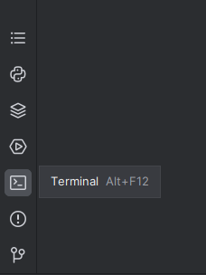

<h1 align="center">POKÉMON TCG API TESTING PROJECT</h1>  
<p align="center">
    
</p>

<h2 align="center">Used stack</h2>
<p align="center">
    <a href="https://www.python.org/">
        
    </a>
    <a href="https://www.jetbrains.com/pycharm/">
        
    </a>
    <a href="https://restfulapi.net/http-methods/">
        
    </a>
    <a href="https://www.selenium.dev/documentation/webdriver/">
        
    </a>
    <a href="https://docs.pytest.org/">
        
    </a>
    <a href="https://git-scm.com/">
        
    </a>
    <a href="https://allurereport.org/">
        
    </a>
</p>  

<h2 align="center">Content</h2>  

* [Description](#description)  
* [Tests launch](#tests-launch)  
   * [Preparing the environment](#preparing-the-environment)  
   * [Launch](#launch)  
   * [Generating a test report](#generating-a-test-report)  
   * [Search request settings](#search-request-settings)
* [Tests results](#tests-results)  

## Description

Tests are developed using [Python](https://www.python.org/) programming language, [Requests](https://pypi.org/project/requests/) library, [Selenium WebDriver](https://www.selenium.dev/documentation/webdriver/) and [PyTest](https://docs.pytest.org/) frameworks. Reports are generated by [Allure Report](https://allurereport.org/). Test reports are also sent by [Telegram Bot](https://core.telegram.org/bots) if you launch tests [using Jenkins](#launch-using-jenkins).  
In this project we test [Pokémon TCG API](https://docs.pokemontcg.io/) ```GET``` REST API HTTP method for the following cases:
* Get cards/sets list.
* Get card/set by its id.
* Cards search by its exact matching name.

But that's not all! For the cards search and getting card by its id there is a bonus: opening its images in [Google Chrome](https://www.google.com/intl/en_us/chrome/) browser with the following transferring its screenshot to Allure Report.

## Tests launch

### Preparing the environment

Before launch, you need to install the following (installation guide links are provided):  
* [PyCharm](https://www.jetbrains.com/pycharm/).  
* [Requests](https://pypi.org/project/requests/).  
* [Selenium](https://selenium-python.readthedocs.io/installation.html).  
* [PyTest](https://docs.pytest.org/en/7.4.x/getting-started.html#install-pytest).  
* [Allure Pytest](https://pypi.org/project/allure-pytest/).  
* [Google Chrome](https://www.google.com/intl/en_us/chrome/).

Also, download the repository with this project on your PC/laptop:  
* Click on "**<> Code**" on the [project page](https://github.com/engovadzip/pokemon_API_project).  
* In the opened pop-up menu click on "**Download ZIP**".  
* Download it to preferred directory and unpack downloaded archive there.  

### Launch

Open any downloaded project's file in PyCharm (right click on file -> Edit with PyCharm). There will be the following window:  
<p align="center">
    
</p>

Click on **Open in Project**. After that there will be a following window:  
<p align="center">
    
</p>

Click on **Trust Project**.  
Open a terminal in the opened PyCharm window by clicking on terminal button. The button locates at the bottom of the left sidebar as shown in the following figure:
<p align="center">
    
</p>
The terminal will open in the bottom of PyCharm as shown in the following figure:
<p align="center">
    
</p>

Launch tests using the following command:  
```
pytest
```
There will be tests result line in terminal when tests will finish. Its example:  
<p align="center">
    
</p>

### Generating a test report

Tests report is generated by Allure Report. To check it, run the following command after tests:  
```
allure serve allure-results
```  
After that, your system's default browser will open and there will be a [generated report](#tests-results).  

### Search request settings

By default, search request is "pikachu". You can set it using parameter ```--search``` in command line.  
For example, if you want to search "hitmonlee" cards, run the following command:
```
pytest --search=hitmonlee
```  
Its command result from Allure Report is provided below:
<p align="center">
      
</p>  

If you don't set ```--search``` parameter, it will have default value as described above.

## Tests results
Tests results are provided in Allure report as shown below:
<p align="center">
      
</p>  
<p align="center">
      
</p>  
<p align="center">
      
</p>  
